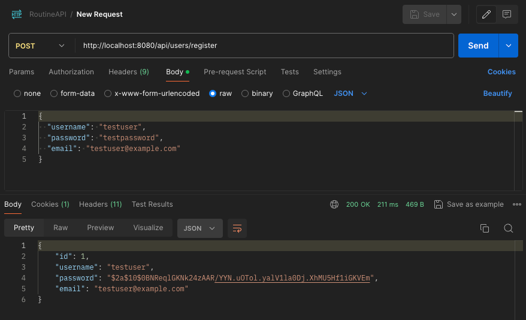

= Routine App Tutorial Stage 1: Initial Prototype (Monolithic) - Detailed Instructions

This document outlines the structure and implementation of the dev.algo.routine full-stack application.
Specifically, this document is a tutorial on how to build the initial monolithic application.

== 1. Backend Setup

=== 1.1 Set up Spring Boot project

Create an initial project

1. Configure from web https://start.spring.io/.
2. Specifically, use this https://start.spring.io/#!type=maven-project&language=java&platformVersion=3.3.3&packaging=jar&jvmVersion=17&groupId=dev.algo.routine&artifactId=backend&name=backend&description=Routine%20App%20Backend&packageName=dev.algo.routine.backend&dependencies=web,data-jpa,postgresql,security,lombok[predefined configuration] using java 17 and maven, adding web, data-jpa, postgresql, security, and lombok dependencies.
3. Generate, download, unzip
4. Import the project in your IDEA Import: Project properties > Import module

=== 1.2 Configure PostgreSQL database

Setting up a robust database is crucial for the application.
Set up PostgreSQL, a powerful open-source relational database system.

1. Install PostgreSQL if not already installed
2. Create a new database named `routine_db`
3. Open the `src/main/resources/application.properties` and add the db connection details
+
[source,properties]
----
include::../../backend/src/main/resources/application.properties[lines=2..-1]
----
4. Create a file `application-dev.properties` to store db user and password
+
[source,properties]
----
spring.datasource.username=your_username
spring.datasource.password=your_password
----

[NOTE]
--
- You should gitignore the `dev.properties`.
- In a production environment, consider using environment variables or a secure vault for sensitive information.
--

=== 1.3 Create JPA entities

Entities are the backbone of our data model. They represent the structure of our database tables in Java objects.

1. Create a new package `dev.algo.routine.backend.model`
2. Create `User.java`:
+
[source,java]
----
include::../../backend/src/main/java/dev/algo/routine/backend/model/User.java[lines=5..-1]
----
3. Create `Task.java`:
+
[source,java]
----
include::../../backend/src/main/java/dev/algo/routine/backend/model/Task.java[lines=7..-1]
----

NOTE: Consider adding additional fields like `createdAt` and `updatedAt` for better tracking of records.

=== 1.4 Implement repositories

Repositories provide an abstraction layer for database operations, allowing us to interact with our entities easily.

1. Create a new package `dev.algo.routine.backend.repository`
2. Create `UserRepository.java`:
+
[source,java]
----
include::../../backend/src/main/java/dev/algo/routine/backend/repository/UserRepository.java[lines=5..-1]
----
3. Create `TaskRepository.java`:
+
[source,java]
----
include::../../backend/src/main/java/dev/algo/routine/backend/repository/TaskRepository.java[lines=9..-1]
----

NOTE: For more complex queries, consider using `@Query` annotations or `QueryDSL` for type-safe queries.

=== 1.5 Create services

Services encapsulate our business logic, providing a clean separation between the web layer and data access layer.

1. Create a new package `dev.algo.routine.backend.service`
2. Create `UserService.java`:
+
[source,java]
----
include::../../backend/src/main/java/dev/algo/routine/backend/service/UserService.java[lines=9..-1]
----
3. Create `TaskService.java`:
+
[source,java]
----
include::../../backend/src/main/java/dev/algo/routine/backend/service/TaskService.java[lines=9..-1]
----

NOTE: Consider adding validation logic and error handling in these service methods for robustness.

=== 1.6 Implement REST controllers

Controllers handle HTTP requests and responses, defining the API endpoints for our application.

1. Create a new package `dev.algo.routine.backend.controller`
2. Create `UserController.java`:
+
[source,java]
----
include::../../backend/src/main/java/dev/algo/routine/backend/controller/UserController.java[lines=10..-1]
----
3. Create `TaskController.java`:
+
[source,java]
----
include::../../backend/src/main/java/dev/algo/routine/backend/controller/TaskController.java[lines=12..-1]
----

NOTE: Consider implementing pagination for the getTasks endpoint to handle large numbers of tasks efficiently.

=== 1.7 Add Login Endpoint

Implement an `/api/auth/login` endpoint, which will allow login from the frontend

1. Create `AuthController.java`
+
[source,java]
----
include::../../backend/src/main/java/dev/algo/routine/backend/controller/AuthController.java[lines=22..-1]
----

=== 1.8 Implement basic Spring Security configuration

Security is crucial for any application. Here, we set up basic authentication and authorization rules.

1. Create a new package `dev.algo.routine.backend.config`
2. Create `SecurityConfig.java`:
+
[source,java]
----
include::../../backend/src/main/java/dev/algo/routine/backend/config/SecurityConfig.java[lines=19..-1]
----
3. Create `CustomUserDetailsService.java`:
+
[source,java]
----
include::../../backend/src/main/java/dev/algo/routine/backend/config/CustomUserDetailsService.java[lines=9..-1]
----

[NOTE]
--
- For production, consider implementing JWT (JSON Web Tokens) for stateless authentication and more granular authorization rules.
- SecurityConfig configures CORS, enable unauthenticated access to register and login endpoints, and authenticated access to tasks endpoints
--

=== 1.9 Running the Backend

To run the application:

1. Ensure PostgreSQL is running and the database is created
2. Run the Spring Boot application
3. The API will be available at `http://localhost:8080`

[source,bash]
----
mvn clean install -U
mvn spring-boot:run
----

=== 1.10 API Endpoints

When the backend is running, you can test the endpoints with a tool like Postman:

- POST `/api/users/register`: Register a new user
- POST `/api/tasks`: Create a new task
- GET `/api/tasks`: Get all tasks for the authenticated user
- PUT `/api/tasks/{id}`: Update a task
- DELETE `/api/tasks/{id}`: Delete a task

Example:
Use Postman to send a POST request to http://localhost:8080/api/users/register with a JSON body like this:

[source,json]
----
{
  "username": "testuser",
  "password": "testpassword",
  "email": "testuser@example.com"
}
----

If the user registration is successful, you should be able to use these credentials to log in at the browser prompt. 
So, access https://localhost8080 and login with testuser:testpassword

NOTE: Remember to implement proper error handling, validation, and testing for a production-ready application.
