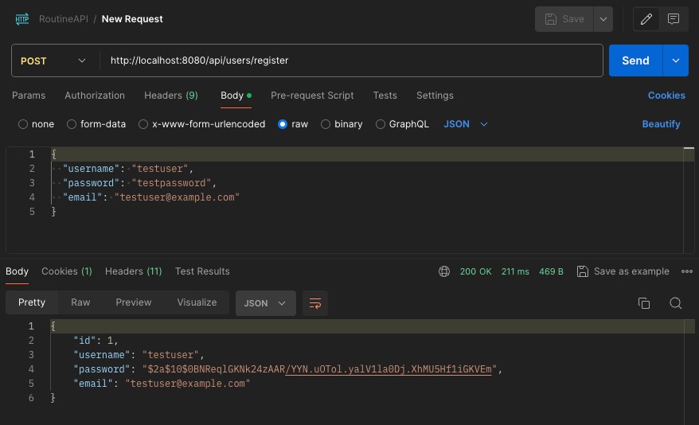

# Routine App Stage 1: Initial Prototype (Monolithic) - Detailed Instructions

This document outlines the structure and implementation of the dev.algo.routine full stack application.
Specifically, this document addresses how the monolithic application is built

## 1. Backend Setup

### 1.1 Set up Spring Boot project

1. web https://start.spring.io/
2. Configure: [link](https://start.spring.io/#!type=maven-project&language=java&platformVersion=3.3.3&packaging=jar&jvmVersion=17&groupId=dev.algo.routine&artifactId=backend&name=backend&description=Routine%20App%20Backend&packageName=dev.algo.routine.backend&dependencies=web,data-jpa,postgresql,security,lombok)
3. "Generate", download, unzip 
4. IDEA Import: Project properties > Import module

### 1.2 Configure PostgreSQL database

Setting up a robust database is crucial for our application. 
We'll use PostgreSQL, a powerful open-source relational database system.

1. Install PostgreSQL if not already installed
2. Create a new database named `routine_app`
3. Open `src/main/resources/application.properties` and add:

```properties
# DB connection
spring.datasource.url=jdbc:postgresql://localhost:5432/routine_db
spring.datasource.driver-class-name=org.postgresql.Driver
spring.jpa.hibernate.ddl-auto=update
spring.jpa.properties.hibernate.dialect=org.hibernate.dialect.PostgreSQLDialect
spring.jpa.show-sql=true
# The following line is for using Spring Profiles
spring.profiles.active=dev
```

Create a file `application-dev.properties` and put the content below.
Make sure to gitignore the file, to avoid committing user:pass on git.

```properties
spring.datasource.username=your_username
spring.datasource.password=your_password
```

Note: In a production environment, consider using environment variables or a secure vault for sensitive information.

### 1.3 Create JPA entities

Entities are the backbone of our data model. They represent the structure of our database tables in Java objects.

1. Create a new package `dev.algo.routine.backend.model`
2. Create `User.java`:

```java
package dev.algo.routine.backend.model;

import lombok.Data;
import javax.persistence.*;

@Data
@Entity
@Table(name = "users")
public class User {
    @Id
    @GeneratedValue(strategy = GenerationType.IDENTITY)
    private Long id;

    @Column(nullable = false, unique = true)
    private String username;

    @Column(nullable = false)
    private String password;

    @Column(nullable = false, unique = true)
    private String email;
}
```

3. Create `Task.java`:

```java
package dev.algo.routine.backend.model;

import lombok.Data;
import javax.persistence.*;
import java.time.LocalDateTime;

@Data
@Entity
@Table(name = "tasks")
public class Task {
    @Id
    @GeneratedValue(strategy = GenerationType.IDENTITY)
    private Long id;

    @Column(nullable = false)
    private String title;

    private String description;

    @Column(nullable = false)
    private LocalDateTime dueDate;

    @ManyToOne
    @JoinColumn(name = "user_id", nullable = false)
    private User user;

    private boolean completed;
}
```

Note: Consider adding additional fields like `createdAt` and `updatedAt` for better tracking of records.

### 1.4 Implement repositories

Repositories provide an abstraction layer for database operations, allowing us to interact with our entities easily.

1. Create a new package `dev.algo.routine.backend.repository`
2. Create `UserRepository.java`:

```java
package dev.algo.routine.backend.repository;

import dev.algo.routine.backend.model.User;
import org.springframework.data.jpa.repository.JpaRepository;

public interface UserRepository extends JpaRepository<User, Long> {
    User findByUsername(String username);
}
```

3. Create `TaskRepository.java`:

```java
package dev.algo.routine.backend.repository;

import dev.algo.routine.backend.model.Task;
import dev.algo.routine.backend.model.User;
import org.springframework.data.jpa.repository.JpaRepository;

import java.util.List;

public interface TaskRepository extends JpaRepository<Task, Long> {
    List<Task> findByUser(User user);
}
```

Note: For more complex queries, consider using `@Query` annotations or `QueryDSL` for type-safe queries.

### 1.5 Create services

Services encapsulate our business logic, providing a clean separation between the web layer and data access layer.

1. Create a new package `dev.algo.routine.backend.service`
2. Create `UserService.java`:

```java
package dev.algo.routine.backend.service;

import dev.algo.routine.backend.model.User;
import dev.algo.routine.backend.repository.UserRepository;
import org.springframework.beans.factory.annotation.Autowired;
import org.springframework.security.crypto.password.PasswordEncoder;
import org.springframework.stereotype.Service;

@Service
public class UserService {
    @Autowired
    private UserRepository userRepository;

    @Autowired
    private PasswordEncoder passwordEncoder;

    public User createUser(User user) {
        // encode the password before saving
        user.setPassword(passwordEncoder.encode(user.getPassword()));
        return userRepository.save(user);
    }

    public User findByUsername(String username) {
        return userRepository.findByUsername(username);
    }
}
```

3. Create `TaskService.java`:

```java
package dev.algo.routine.backend.service;

import dev.algo.routine.backend.model.Task;
import dev.algo.routine.backend.model.User;
import dev.algo.routine.backend.repository.TaskRepository;
import org.springframework.beans.factory.annotation.Autowired;
import org.springframework.stereotype.Service;

import java.util.List;

@Service
public class TaskService {
    @Autowired
    private TaskRepository taskRepository;

    public Task createTask(Task task) {
        return taskRepository.save(task);
    }

    public List<Task> getTasksForUser(User user) {
        return taskRepository.findByUser(user);
    }

    public Task updateTask(Task task) {
        return taskRepository.save(task);
    }

    public void deleteTask(Long taskId) {
        taskRepository.deleteById(taskId);
    }
}
```

Note: Consider adding validation logic and error handling in these service methods for robustness.

### 1.6 Implement REST controllers

Controllers handle HTTP requests and responses, defining the API endpoints for our application.

1. Create a new package `dev.algo.routine.backend.controller`
2. Create `UserController.java`:

```java
package dev.algo.routine.backend.controller;

import dev.algo.routine.backend.model.User;
import dev.algo.routine.backend.service.UserService;
import org.springframework.beans.factory.annotation.Autowired;
import org.springframework.http.ResponseEntity;
import org.springframework.web.bind.annotation.*;

@RestController
@RequestMapping("/api/users")
public class UserController {
    @Autowired
    private UserService userService;

    @PostMapping("/register")
    public ResponseEntity<User> registerUser(@RequestBody User user) {
        User createdUser = userService.createUser(user);
        return ResponseEntity.ok(createdUser);
    }
}
```

3. Create `TaskController.java`:

```java
package dev.algo.routine.backend.controller;

import dev.algo.routine.backend.model.Task;
import dev.algo.routine.backend.model.User;
import dev.algo.routine.backend.service.TaskService;
import dev.algo.routine.backend.service.UserService;
import org.springframework.beans.factory.annotation.Autowired;
import org.springframework.http.ResponseEntity;
import org.springframework.security.core.Authentication;
import org.springframework.web.bind.annotation.*;

import java.util.List;

@RestController
@RequestMapping("/api/tasks")
public class TaskController {
    @Autowired
    private TaskService taskService;

    @Autowired
    private UserService userService;

    @PostMapping
    public ResponseEntity<Task> createTask(@RequestBody Task task, Authentication authentication) {
       // Get the authenticated user
        User user = userService.findByUsername(authentication.getName());
        task.setUser(user);
        Task createdTask = taskService.createTask(task);
        return ResponseEntity.ok(createdTask);
    }

    @GetMapping
    public ResponseEntity<List<Task>> getTasks(Authentication authentication) {
        User user = userService.findByUsername(authentication.getName());
        List<Task> tasks = taskService.getTasksForUser(user);
        return ResponseEntity.ok(tasks);
    }

    @PutMapping("/{taskId}")
    public ResponseEntity<Task> updateTask(@PathVariable Long taskId, @RequestBody Task task, Authentication authentication) {
        User user = userService.findByUsername(authentication.getName());
        task.setId(taskId);
        task.setUser(user);
        Task updatedTask = taskService.updateTask(task);
        return ResponseEntity.ok(updatedTask);
    }

    @DeleteMapping("/{taskId}")
    public ResponseEntity<Void> deleteTask(@PathVariable Long taskId) {
        taskService.deleteTask(taskId);
        return ResponseEntity.ok().build();
    }
}
```

Note: Consider implementing pagination for the getTasks endpoint to handle large numbers of tasks efficiently.

### 1.7 Implement basic Spring Security configuration

Security is crucial for any application. Here, we set up basic authentication and authorization rules.

1. Create a new package `dev.algo.routine.backend.config`
2. Create `SecurityConfig.java`:

```java
package dev.algo.routine.backend.config;

import org.springframework.context.annotation.Bean;
import org.springframework.context.annotation.Configuration;
import org.springframework.context.annotation.Profile;
import org.springframework.security.config.annotation.web.builders.HttpSecurity;
import org.springframework.security.config.annotation.web.configuration.EnableWebSecurity;
import org.springframework.security.config.annotation.web.configurers.AbstractHttpConfigurer;
import org.springframework.security.crypto.bcrypt.BCryptPasswordEncoder;
import org.springframework.security.crypto.password.PasswordEncoder;
import org.springframework.security.web.SecurityFilterChain;

@Configuration
@Profile("dev")
@EnableWebSecurity
public class SecurityConfig {

   @Bean
   public SecurityFilterChain securityFilterChain(HttpSecurity http) throws Exception {
      http
              .csrf(AbstractHttpConfigurer::disable) // Disable CSRF for simplicity. Enable in production.
              .authorizeHttpRequests(auth -> auth
                      .requestMatchers("/api/users/register").permitAll()
                      .anyRequest().authenticated()
              )
              .httpBasic( httpBasic -> {}); // Use HTTP Basic Authentication
      return http.build();
   }

   @Bean
   public PasswordEncoder passwordEncoder() {
      return new BCryptPasswordEncoder();
   }
}
```

3. Create `CustomUserDetailsService.java`:

```java
package dev.algo.routine.backend.config;

import dev.algo.routine.backend.model.User;
import dev.algo.routine.backend.service.UserService;
import org.springframework.beans.factory.annotation.Autowired;
import org.springframework.security.core.userdetails.UserDetails;
import org.springframework.security.core.userdetails.UserDetailsService;
import org.springframework.security.core.userdetails.UsernameNotFoundException;
import org.springframework.stereotype.Service;

@Service
public class CustomUserDetailsService implements UserDetailsService {

    @Autowired
    private UserService userService;

    @Override
    public UserDetails loadUserByUsername(String username) throws UsernameNotFoundException {
        User user = userService.findByUsername(username);
        if (user == null) {
            throw new UsernameNotFoundException("User not found");
        }
        // Convert our custom User to Spring's UserDetails
        return org.springframework.security.core.userdetails.User
                .withUsername(user.getUsername())
                .password(user.getPassword())
                .roles("USER")
                .build();
    }
}
```

Note: For production, consider implementing JWT (JSON Web Tokens) for stateless authentication and more granular authorization rules.

### 1.8 Add Login Endpoint

Implement an `/api/auth/login` endpoint, to allow login from the frontend

1. Create `AuthController.java`

```java
package dev.algo.routine.backend.controller;

import dev.algo.routine.backend.model.User;
import dev.algo.routine.backend.service.UserService;
import lombok.Data;
import org.springframework.beans.factory.annotation.Autowired;
import org.springframework.http.HttpStatus;
import org.springframework.http.ResponseEntity;
import org.springframework.security.authentication.AuthenticationManager;
import org.springframework.security.authentication.BadCredentialsException;
import org.springframework.security.authentication.UsernamePasswordAuthenticationToken;
import org.springframework.security.core.Authentication;
import org.springframework.security.core.AuthenticationException;
import org.springframework.security.core.context.SecurityContextHolder;
import org.springframework.stereotype.Controller;
import org.springframework.web.bind.annotation.RequestBody;
import org.springframework.web.bind.annotation.RequestMapping;

import java.util.HashMap;
import java.util.Map;

@Controller
@RequestMapping("/api/auth")
public class AuthController {

    @Autowired
    private AuthenticationManager authenticationManager;

    @Autowired
    private UserService userService;

    @PostMapping("/login")
    public ResponseEntity<?> authenticateUser(@RequestBody LoginRequest loginRequest) {
        try{
            Authentication authentication = authenticationManager.authenticate(
                    new UsernamePasswordAuthenticationToken(
                            loginRequest.getUsername(),
                            loginRequest.getPassword()
                    )
            );

            SecurityContextHolder.getContext().setAuthentication(authentication);

            User user = userService.findByUsername(loginRequest.getUsername());

            Map<String, String> response = new HashMap<>();
            // TODO In a real app, generate a proper JWT token here
            response.put("token", "dummy-token");
            response.put("username", user.getUsername());

            return ResponseEntity.ok(response);
        } catch (AuthenticationException e) {
            return ResponseEntity.status(HttpStatus.UNAUTHORIZED)
                    .body("Invalid username or password");
        }
    }
}

@Data
class LoginRequest {
    private String username;
    private String password;
}
```

2. Update `SecurityConfig.java` to configure CORS, enable unauthenticated access to login endpoint, and authenticated access to the tasks endpoints

```java
package dev.algo.routine.backend.config;

// ...

public class SecurityConfig {

    @Bean
    public SecurityFilterChain securityFilterChain(HttpSecurity http) throws Exception {
        http
                .csrf(AbstractHttpConfigurer::disable) // Disable CSRF for simplicity. Enable in production.
                .cors( cors -> cors.configurationSource())
                .authorizeHttpRequests(auth -> auth
                        .requestMatchers("/api/users/register", "/api/auth/login").permitAll()
                        .requestMatchers("/api/tasks/**").authenticated()
                        .anyRequest().authenticated()
                )
                .httpBasic( httpBasic -> {}); // Use HTTP Basic Authentication
        return http.build();
    }

    // ...

    @Bean
    public AuthenticationManager authenticationManager(AuthenticationConfiguration authenticationConfiguration) throws Exception {
        return authenticationConfiguration.getAuthenticationManager();
    }

    @Bean
    public CorsConfigurationSource corsConfigurationSource() {
        CorsConfiguration configuration = new CorsConfiguration();
        // only react development server allowed
        configuration.setAllowedOrigins(Arrays.asList("http://localhost:3000"));
        configuration.setAllowedMethods(Arrays.asList("GET", "POST", "PUT", "DELETE", "OPTIONS"));
        configuration.setAllowedHeaders(Arrays.asList("Authorization", "Content-Type"));
        // Headers that the browser is allowed to access
        configuration.setExposedHeaders(Arrays.asList("Authorization"));
        // how many seconds the browser should cache the CORS configuration
        configuration.setMaxAge(3600L);
        UrlBasedCorsConfigurationSource source = new UrlBasedCorsConfigurationSource();
        // register that CORS configuration on all paths
        source.registerCorsConfiguration("/**", configuration);
        return source;
    }
}

```

### 1.9 Running the Backend

To run the application:

1. Ensure PostgreSQL is running and the database is created
2. Run the Spring Boot application
3. The API will be available at `http://localhost:8080`

```bash
mvn clean install -U
mvn spring-boot:run
```

### 1.10 API Endpoints

When the backend is running, you can test the endpoints with a tool like Postman:

- POST `/api/users/register`: Register a new user
- POST `/api/tasks`: Create a new task
- GET `/api/tasks`: Get all tasks for the authenticated user
- PUT `/api/tasks/{id}`: Update a task
- DELETE `/api/tasks/{id}`: Delete a task

Example
Use Postman to send a POST request to http://localhost:8080/api/users/register with a JSON body like this:
```json
{
  "username": "testuser",
  "password": "testpassword",
  "email": "testuser@example.com"
}
```



If the user registration is successful, you should be able to use these credentials to log in at the browser prompt. 
So, access https://localhost8080 and login with testuser:testpassword


### 1.11 Notes

Remember to implement proper error handling, validation, and testing for a production-ready application.